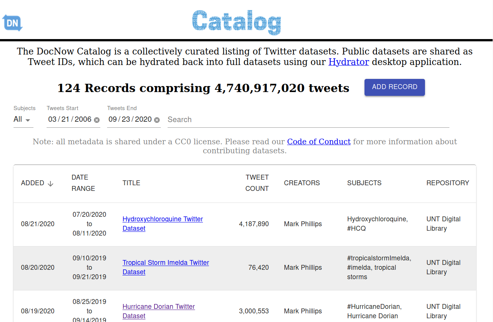

#

<h2>Less is (sometimes) more</h2>

Preservation strategies for the social web.

   

Ed Summers / [MITH]

#

#

::: left

... there is no way of precisely defining the designated community, and similarly
no way of foretelling the properties that future users might deem significant.
This leads to pressure for preservation that must be faithful to the original in
all respects.

:::

 

Chris Rusbridge (2006)

#

::: left

The simplest technologies to maintain and understand today are the simplest to
carry forward and to recreate in the future.

:::

 

John Kunze (2005)

#

::: left

When designing computer systems, one is often faced with a choice between using
a more or less powerful language for publishing information, for expressing
constraints, or for solving some problem. This finding explores tradeoffs
relating the choice of language to reusability of information. The “Rule of
Least Power” suggests choosing the least powerful language suitable for a given
purpose.

:::

Tim Berners-Lee (1998)

# 

::: left

1. Social media presents an huge opportunity for documenting previously
undocumented historical events.

:::

#

<iframe width="700" height="415" src="https://www.youtube.com/embed/atX14DDvKbw"
frameborder="0" allow="accelerometer; autoplay; clipboard-write;
encrypted-media; gyroscope; picture-in-picture" allowfullscreen></iframe>

Whose Digital Preservation? - Michelle Caswell

#

::: left

2. Researchers of all disciplinary stripes routinely create collections of
   social media for use as data in their research. But they by and large
   are not providing access to these collections because platforms forbid it.

:::

#

::: left

3. Content creators in social media have little control over how their data is
   being used in archives, and are largely commodities in surveillance
   capitalism (Zuboff, 2015).

:::

# 

https://catalog.docnow.io

# {data-background="images/twarc.jpg"}

                   

https://github.com/docnow/twarc

# 

https://github.com/docnow/hydrator

#

#

#

#

#

Less is (sometimes) more.

[MITH]: https://mith.umd.edu

